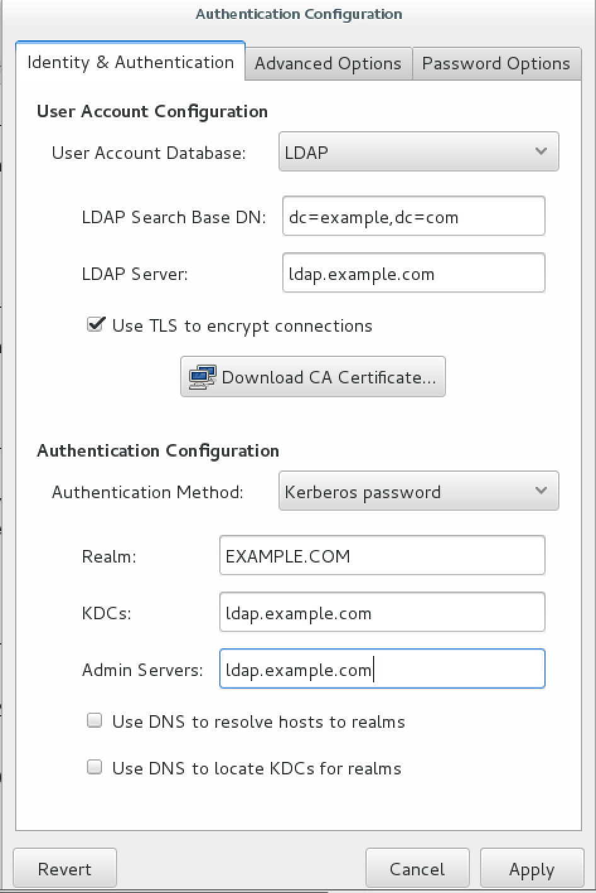

#RHCSA Training
##Objectives
- [1 recovery](./objectives/1_recovery.md)
- [2 essential tools](./objectives/2_essential_tools.md)
- [3 operate running systems](./objectives/3_operate_running_systems.md)
- [4 configure local storage](./objectives/4_configure_local_storage.md)
- [5 file systems](./objectives/5_file_systems.md)
- [6 maintain systems](./objectives/6_maintain_systems.md)
- [7 manage users and groups](./objectives/7_manage_users_and_groups.md)
- [8 selinux](./objectives/8_selinux.md)

##Commands
- [swapon](./commands/swapon.md)
- [system-config-authentication](./commands/system-config-authentication.md)

##Packages
- [authconfig-gtk](./packages/authconfig-gtk.md)
- [chrony](./packages/chrony.md)
- [cifs-utils](./packages/cifs-utils.md)
- [ipa-client](./packages/ipa-client.md)
- [krb5-workstation](./packages/krb5-workstation.md)
- [nfs-utils](./packages/nfs-utils.md)
- [nss-pam-ldapd](./packages/nss-pam-ldapd.md)
- [openldap-clients](./packages/openldap-clients.md)
- [samba-client](./packages/samba-client.md)
- [settroubleshoot-server](./packages/settroubleshoot-server.md)

##Services
- [nmb](./services/nmb.md)
- [rpcbind](./services/rpcbind.md)
- [smb](./services/smb.md)
- [winbind](./services/winbind.md)

##Course Objectives
# objectives: 1_recovery

The following objective is to Recover / Reset the root password on a RHEL 7 system.

###Rescue Process (lost root password)
- start or reboot the system
- at the grub menu, press the [ESC] key to interrupt the boot proc
- press 'e' to edit the boot record
- scroll down to the 'linux16' entry and press the [end] key
- add `rd.break console=tty1`
- press CTRL-X to boot
- remount in r/w mode: `mount -o remount,rw /sysroot`
- switch to chroot jail: `chroot /sysroot`
- reset pw: `passwd root`
- create SELinux blank file under root: `touch /.autorelabel`
- type `exit` twice to reboot system 

# objectives: 2_essential_tools

###Archive, compress, unpack and uncompress files:

|  Tool      |   Archive                    |  Extract                  |
|:----------:|:----------------------------:|:-------------------------:|
| tar (gzip) | `tar cfzv archive.tar.gz`    | `tar xvf archive.tar.gz .`|
| tar (bzip) | `tar cfjv archive.tar.bz`    | `tar xvf archive.tar.bz .`|
| star       | `star -c -f=archive.tar dir/`| `star -x -f=archive.tar .`|
| gzip       | `gzip file`                  | `gunzip file.gz`          |
| bzip2      | `bzip2 file`                 | `bunzip file.bz2`         |

####Create a test directory with 3 files, list, change ownership
- `mkdir test && touch test/{file1,file2,file3}` - create some directories
- `ls -l test/`                                  - list in long mode
- `chown -R nobody:wheel test/`                  - recursively change owner & group

####Changing Modes (octal & ugo)
- `chmod 0755 test/file1`                - change mode to 0755 octal way
- `chmod u=rwx,g=rx,o=rx test/file{2,3}` - change mode to 0755 ugo way
- `ls -l test/`                          - list changes to verify

####Set Special Permissions (files / directories)
- `chmod 1750 test/file1` - Sticky Bit
- `chmod 2750 test/file2` - Set GID
- `chmod 4750 test/file3` - Set UID

# objectives: 3_operate_running_systems

###Boot systems into different targets manually
- `systemctl list-units --type=target --all` - view full list of targets 
- `systemctl get-default`                    - get default run-level 
- `systemctl isolate multi-user.target`      - change to multi-user (RL 3) 
- `systemctl isolate graphical.target`       - switch to graphical  (RL 5) 
- `systemctl set-default graphical.target`   - set default to graphical 

###Identify CPU/memory intensive processes, adjust with renice & kill
- open up new tab
- `nice -n -10 yes` - start basic process with a nice level of -10
- `top` - view nice level of existing programs
`renice [-n] priority [-g|-p|-u] identifiers (group, pid, user)`

####Renice
- `renice -n 5 -p 1701`   - change priority to proc 
- `renice -n 5 -g wheel`  - change priority by group 
- `renice -n 5 -u johnny` - change priority by user 

####Start, stop and pause a process
- `kill (-SIGSTOP | -19)  pid` - suspend process to be continued later 
- `kill (-SIGCONT | -18)  pid` - continue a process that was suspended 
- `kill (-SIGTERM | -15)  pid` - kill a process, can be gracefully caught 
- `kill (-SIGKILL | -9)   pid` - kill a process, cannot be caught 

####Start, stop and check status of network services
- `systemctl status name.service` - check status 
  - same format for service: start, stop, restart, reload, enable
- `systemctl enable name.service` - enable service at boot 

# objectives: 4_configure_local_storage

####List, create, delete partions on MBR and GPT disks
- `fdisk -l` - list all partitions
- `fdisk /dev/vda` - create a new primary partition 
- `[n]` - for new partition
- `[p]` - primary
- `(1-4)` - partition number
- `<size/sector>` - choose appropriate sizing
- `[t]` - filesystem type, `8e` for LVM, `82` for swap
- `[w]` - save the partition changes
- `partprobe` - force kernel to read updated partition table
- `mkfs.ext4 /dev/vda1` - format the disk for ext4
- `mkfs.xfs /dev/vda2` - format the disk for xfs
- `mkfs.vfat /dev/vda3` - format the disk for vfat
- `mkdir /mnt/{ext4,xfs,vfat}` - create mount points for each filesystem
- `blkid /dev/vda[n]` - retrieve UUID for appropriate partition
- update `/etc/fstab` with appopriate entry
```
#/etc/fstab
UUID='...' /dev/vda1 /mnt/ext4 ext4 defaults 0 2
UUID='...' /dev/vda2 /mnt/xfs xfs defaults 0 0
UUID='...' /dev/vda3 /mnt/vfat vfat defaults 0 0
```
- `mount -a` - mount all filesystems

####Create and remove physical volumes, assign physical volumes to volume groups, and create and delete logical volumes
- `lsblk -a`                             - display current block devices and configuration
- `pvcreate /dev/vdb1`                   - create a physical volume
- `vgcreate <vgname> -s 8m /dev/vdb1`    - create volume group, set extant size (4m default, set to 8m)
- `lvcreate -n <lvname> -L 25G <vgname>` - create logical volume, assign name and size
- `mkfs.xfs /dev/<vgname>/<lvname>`      - create filesystem (xfs) on logical volume
- `mkdir /mnt/lvm`                       - create mountpoint
- `blkid /dev/<vgname>/<lvname`          - display UUID
- `vi /etc/fstab`                        - update fstab

```
UUID="..." /mnt/lvm xfs defaults 0 0
# or
/dev/vg1/lv1 /mnt/lvm xfs defaults 0 0
```

####Add swap to a system non-destructively
- `lvcreate -L 1G -n <lv_swapname> <vgname>` - create new logical volume for swap space 
- `mkswap /dev/<vgname>/<lv_swapname>`       - create swap 
- `swapon /dev/<vgname>/<lv_swapname>`       - activate swap
- `swapon -s`                                - verify swap summary
- `vi /etc/fstab`                            - update fstab
- `/dev/vg/swap swap swap defaults 0 0`      - entry 

# objectives: 5_file_systems

###Create, mount and unmount filesystems (ext4, xfs, vfat)
- `lvcreate -L 100M -n <lv_name> /dev/<vgname>` - create new volume
- `mkfs.<ext4|xfs|vfat> /dev/<vgname>/<lvname>` - create ext4 filesystem
- `mount /dev/<vgname><lvname>`                 - manually mount the filesystem
- `vi /etc/fstab`                               - update fstab for each filesystem

```
# /etc/fstab
/dev/vg1/lv1 /mnt/ext4 ext4 defaults 1 2
/dev/vg1/lv1 /mnt/xfs   xfs defaults 0 0
/dev/vg1/lv1 /mnt/vfat vfat defaults 0 0
```

#####Mount and unmount file systems (NFS)
- `yum install -y nfs-utils`           - ensure required NFS services are installed
- `systemctl enable rpcbind.service`   - enable rpcbind
- `systemctl start  rpcbind.service`   - start rpcbind
- `systemctl enable nfs-client.target` - enable nfs-client target
- `systemctl start  nfs-client.target` - start nfs-client target
- `vi /etc/fstab`                      - add fstab entry for nfs4

```
nfsserver:/dir/share /mnt/nfs nfs4 defaults 0 0
```
- `mount -a` - automount fstab entries

#####Mount and unmount file systems (CIFS)
- `yum install -y cifs-utils samba-client` - ensure required CIFS services are installed
- `systemctl enable smb.service`           - enable samba
- `systemctl enable nmb.service`           - enable nmb
- `systemctl enable winbind.service`       - enable windbind
- `vi /etc/fstab`                          - add fstab entry for CIFS

```
//smbserver/share /mnt/cifs cifs rw,username=user,password=pw 0 0
```
- `mount -a` - automount fstab entries

#####Extend existing logical volumes
- `lvcreate -L 100M -n <lvname> /dev/<vgname>`        - create new volume if needed
- `mkfs.ext4 /dev/<vgname>/<lvname>`                  - make an ext4 filesystem
- `mount /dev/<vgname>/<lvname> /mnt/ext4`            - mount it somewhere logical
  - `lvextend -l +100%FREE -r /dev/<vgname>/<lvname>` - allocate ALL free space
  - `lvextend -L +50M -r /dev/<vgname>/<lvname>`      - allocate additional 50M or what have you

#####Create and configure set-GID directories for collaboration
- `groupadd -g 50000 <gname>`   - create a new group
- `mkdir /share`                - create a shared directory in root
- `chown nobody:<gname> /share` - change ownership of dir to *gname*
- `chmod 2770 /share`           - assign / set GID bit (SGID) to /share
  - (allows all members of group write privs, removes all for everyone else)
- `useradd -G <gname> <uname>`  - create new users and assign them this group

#####Create and manage ACLs
- `getfacl <file>`                      - view file ACLs
- `setfacl -Rm u:<username>:rwx <file>` - change file ACL to 7 for user
  - `setfacl g:<groupname>:rwx <file>`  - same but for group
- `setfacl -x u:<username> <file>`      - remove ACLs from file
- `setfacl -b u:<username> <file>`      - *completely* remove ACLs from file

# objectives: 6_maintain_systems

####Configure networking, update connections / devices

- Devices and connections are two distinct things
  - devices are actual interfaces on the system
  - connections can be bound & be turned on/off 
  - only 1 connection can be up at a time
- `nmcli con show` or `nmcli dev status` - display network connections or devices
- `nmcli con del <name|UUID>`       - remove a connection / interface
- `nmcli con add con-name <name> ifname <interface> type ethernet ip4 1.1.1.1/24 gw4 1.1.1.1` 
  - create a connection (provide ip / gateway)
- `nmcli con reload` - reload configs into network manager
- `ip address show` or `ip a`       - check configuration
  - `nmcli con show <name>`         - all information about a connection
- `nmcli con down <name>`           - stop a connection
- `nmcli con up   <name>`           - start a connection
- To modify a connection:
  - `nmcli con mod <name> ipv4.address 1.1.1.1/24` - ip address
  - `nmcli con mod <name> ipv4.gateway 1.1.1.1`    - gateway
  - `nmcli con reload`                             - reload configs into network manager
  - `nmcli con up <name>`                          - ensure connection is up
  - `nmcli con delete <name>`                      - delete the connection when through

#####Hostname updates: statically or dynamically
- `hostnamectl <--static|--transient|--pretty>` - view all current hostnames (static, transient, pretty)
- `hostnamectl set-hostname <name>`             - set the hostname
  - use `--static`, `--transient`, `--pretty` for individual hostnames
- hostname resolution relies on `/etc/nsswitch.conf`
  - `hosts: files dns` - entry resloves first through files (static) then dns (dynamic)
    - *static* comes from `/etc/hosts` file
    - *dynamic* comes from `/etc/resolve.conf` file
- `nmcli con mod <interface> +ipv4.dns 1.1.1.1` - add DNS server
  - `+ipv4.dns` - adds a server
  - `ipv4.dns`  - replaces it
  - `-ipv4.dns` - removes a server
- `nmcli con up <interface>` - restart connection

####Schedule tasks using at and cron

| Minute | Hour | Day Of Month | Month | Day Of Week | CMD             |
|:------:|:----:|:------------:|:-----:|:-----------:|:---------------:|
| 0-59   | 0-23 | 1-31         | 1-12  | 1-7         | /root/script.sh |

- `crontab -u <username> -e` - edit users crontab
- wildcards `*` can be used to match every value
- cron jobs that neet to run routinely can be placed in `/etc/cron.{daily,weekly,monthly}`
  - these must be executable

#####Configure time services using NTP
- `timedatectl`                         - get current config
- `timedatectl list-timezones`          - list available time zones
- `timedatectl set-timezone <timezone>` - set the timezone eg: `America/Chicago`
- `yum install -y ntp`                  - install ntp
- `systemctl enable ntpd.service`       - enable ntpd at boot
- `systemctl start ntpd.service`        - start ntpd
  - config file is at `/etc/ntp.conf` 

#####Configure time services using Chrony
- `yum install -y chrony`           - install chrony
- `systemctl enable cronyd.service` - enable chronyd at boot
- `systemctl start cronyd.service`  - start chronyd
- `ntpdate <timeserver>`            - synchronize server
  - config file is located at `/etc/chrony.conf`
  
####Install and update packages from Redhat network, remote repo or local file system
- `yum-config-manager --add-repo=http://myrepo.com` - leverage this tool to generate repo file 
- `vi /etc/yum.repos.d/<remote>.repo`    - modify the repository to 
```
[base]
[myrepo.com]
name=added from http://myrepo.com
baseurl=http://myrepo.com
enabled=1
gpgcheck=0                        # <----- add this line!
```

# objectives: 7_manage_users_and_groups
####Create, delete and modify local user accounts
- `useradd <username>`                - create a new user
- `useradd -G <group> <username>`     - add existing user to new group
- `usermod -aG <supgroup> <username>` - add user to supplementary group 
- `userdel -r <username>`             - remove the user completely from the system

####Change passwords and adjust password aging for local user accounts
- `chage -M <max_days> <username>` - set the maximum password age
- `chage -I <username>`            - set the account / user to *inactive*
- `chage -d 0 <username>`          - force user to change password at next login
- `date -d "+180 days"`            - determine the date 180+ days from today
- `vi /etc/login.defs`             - update password policy configuration file

####Create, delete and modify local groups and group memberships
- `groupadd -r <groupname>`           - create a new system group
- `groupmod -n <newname> <groupname>` - rename existing group
- `groupmod -g <groupid> <groupname>` - assign a GID to group
- `groupdel <groupname>`              - delete existing group

####Configure a system to use an existing auth service for user/group info
- using LDAP server: `server.example.com`

#####LDAP Client Configuration
- `yum install -y openldap-clients nss-pam-ldapd` - install LDAP tools
- `authconfig-tui`                                - Text user interface wizard to setup LDAP
  - Cache Information
  - Use LDAP
  - Use MD5
  - Use Shadow
  - Use LDAP Auth
  - Local Auth
  - In LDAP Settings:
    - Use TLS: `ldap://server.example.com`, `dc=example,dc=com`
- `/etc/openldap/cacerts` - location of LDAP server cert
- `yum install -y autofs nfs-utils`   - ensure NFS/AUTOFS tools are installed
- `vi /etc/auto.master.d/home.autofs` - create the master entry
  - `/home /etc/auto.home`            - add the primary mountpoint, point to config
- `vi /etc/auto.home` - create *home* automount
  - `*-rw,sync --fstype=nfs4 instructor.example.com:/home/guests/&` - add this line to `/etc/auto.demo`
- `systemctl start autofs.service`    - start up autofs
- `systemctl enable autofs.service`   - enable it
- `su - <ldapuser>`                   - test the configuration

#####Kerberos Configuration
- `yum install authconfig-gtk krb5-workstation` - install Kerberos tools
- `system-config-authentication`                - run the CLI tool to connect to IPA
  - ensure *Kerberos* is checked, and *DNS* is unchecked
    - verify with `getent` and `ssh` (TODO: figure more out about this)
- 
- `yum install ipa-client`                      - ensure IPA tools are installed
- `ipa-client-install --domain=server.example.com --no-ntp --mkhomdir` - connect to test IPA
  - Enter AD credentials provided for adding Linux computers

# objectives: 8_selinux
####Firewall Management (firewall-cmd, firewalld, iptables)
- *Configure firewall settings using firewall-config, firewall-cmd, or iptables*
- `firewall-cmd --permanent <cmd>`                     - must add `--permanent` for changes to persist
- `firewall-cmd --list-all`                            - list configuration
- `firewall-cmd --list-services --zone=<zone|default>` - list added services to default or specific zone
- `firewall-cmd --get-services`                        - available services to enable 
- `firewall-cmd --add-service=<service>`               - enable service in default zone
- `firewall-cmd --add-port=<port/protocol>`            - add a port if not defined
- `firewall-cmd --reload`                              - reload changes
- `firewall-cmd --get-default-zone`                    - see context of default zone

####Diagnose and address routine SELinux policy violations
- `sestatus`                              - show status
- `setenforce Enforcing (or 1)`           - set SELinux to enforcing mode
- `vi /etc/selinux/config`                - config file to set perm state
- `chcon -t <type_t> <file>`              - test changing type label context
- `setsebool -P <boolean> 1|0`            - turn an SELinux boolean on or off
- `ausearch -m avc`                       - audit failures and review
- `grep AVC /var/log/audit/audit.log`     - secondary way to get errors
- `audit2allow -wa`                       - generate steps to make the AVC failure allowed
- `audit2allow -aM <name>.local`          - create a new module/policy package
- `restorecon <file>`                     - restore contexts: `/etc/selinux/targeted/contexts/files/`
- `semanage fcontext -l`                  - view all file contexts (grep if needbe)
- `yum install -y settroubleshoot-server` - install SELinux troubleshooting tools
- `sealert -a /var/log/audit/audit.log`   - displays SELinux policy violations

